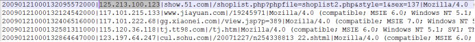
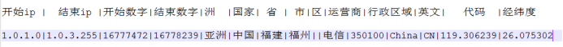

# ip_stat_spark
通过日志信息（运行商或者网站自己生成）和城市ip段信息来判断用户的ip段，统计热点经纬度。

##### **ip日志信息**

在ip日志信息中，我们只需要关心ip这一个维度就可以了，其他的不做介绍

 

##### **城市ip段信息**

 

##### **思路**

​	1、 加载日志数据，获取ip信息

​	2、 加载ip段信息，获取ip起始和结束数字，城市信息

​	3、 将日志的ip分割出来，转换为数字，和ip段比较

​	4、 比较的时候采用二分法查找

​	5、 过滤出相应的值

​	6、 将结果写入到 MySQL 中